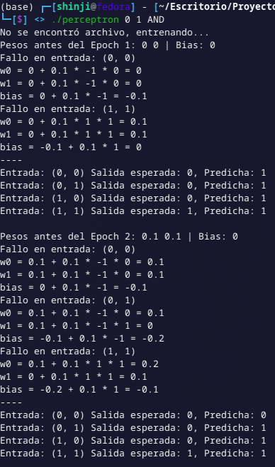
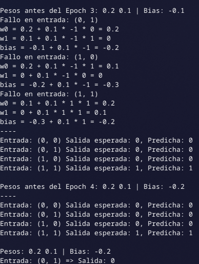
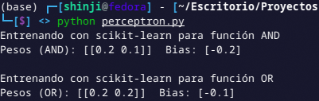

# Perceptron

By Braulio Nayap Maldonado Casilla

## Introducción

El **perceptrón** es uno de los modelos más simples y fundamentales dentro del campo del aprendizaje automático y las redes neuronales artificiales. Fue propuesto por **Frank Rosenblatt** en 1958 como un algoritmo para la clasificación binaria, inspirado en el funcionamiento de las neuronas biológicas. [1]

El perceptrón es una neurona artificial que toma un conjunto de entradas:

```
x = (x₁, x₂, ..., xₙ)
```

con pesos asociados:

```
w = (w₁, w₂, ..., wₙ)
```

y un término de sesgo (bias) `b`, para ser utilizados por una función de activación que produce una salida binaria:

```
y ∈ {0, 1}
```

El valor de entrada neto `z` se calcula como:

```
    z = w₁·x₁ + w₂·x₂ + ... + wₙ·xₙ + b
     \= w · x + b
```

La salida del perceptrón se define mediante la siguiente función:

```
        ⎧ 1 si z ≥ 0
    y = ⎨
        ⎩ 0 si z < 0
```

Este modelo puede aprender operaciones lógicas básicas como **AND** y **OR** mediante entrenamiento supervisado con un conjunto de entradas y salidas esperadas.

El **perceptrón** es uno de los modelos más simples y fundamentales dentro del campo del aprendizaje automático y las redes neuronales artificiales. Fue propuesto por **Frank Rosenblatt** en 1958 como un algoritmo para la clasificación binaria inspirado en el funcionamiento de las neuronas biológicas. [1]

El perceptrón es una neurona artificial que toma un conjunto de entradas:

$$
\mathbf{x} = (x_1, x_2, \dots, x_n)
$$

con pesos asociados:

$$
\mathbf{w} = (w_1, w_2, \dots, w_n)
$$

y un término de sesgo (bias) $b$, para ser utilizados por una función de activación y producir una salida binaria $y \in \{0, 1\}$.

El valor neto de entrada se calcula como:

$$
z = \sum_{i=1}^{n} w_i x_i + b = \mathbf{w} \cdot \mathbf{x} + b
$$

La salida del perceptrón se define como:

$$
y = f(z) =
\begin{cases}
1 & \text{si } z \geq 0 \\
0 & \text{si } z < 0
\end{cases}
$$

## Implementación en C++

Se implemento una de las estructuras más básicas de las redes neuronales. El perceptrón puede aprender funciones lógicas como AND y OR mediante un entrenamiento supervisado.

### Definición de la clase `Perceptron`

La clase define los atributos clave de un perceptrón: pesos (`weights`), sesgo (`bias`), tasa de aprendizaje (`learning_rate`), modo de operación, y opciones para mostrar el proceso de entrenamiento.

```cpp
class Perceptron {
private:
    std::vector<float> weights;
    float bias;
    float learning_rate;
    std::string mode;
    bool show_weight_update = true;
    bool show_predictions = true;
...
}
```

### Constructor

Inicializa los pesos en cero y define la tasa de aprendizaje:

```cpp
Perceptron::Perceptron(int n_inputs, float lr) {
    weights.resize(n_inputs, 0);
    bias = 0;
    learning_rate = lr;
}
```

### Función de activación

Función escalón: devuelve 1 si la suma ponderada es mayor o igual a 0, de lo contrario 0.

```cpp
int Perceptron::activation(float z) {
    return z >= 0 ? 1 : 0;
}
```

### Predicción

Calcula la salida binaria del perceptrón dado un vector de entrada:

```cpp
int Perceptron::predict(const vector<int> &inputs) {
    float z = bias;
    for (size_t i = 0; i < weights.size(); i++)
        z += weights[i] * inputs[i];
    return activation(z);
}
```

### Entrenamiento

Itera hasta que los pesos converjan. Imprime los pesos antes de cada época, ajusta los pesos con `update_weights` y verifica convergencia:

```cpp
void Perceptron::train(const vector<vector<int>> &X, const vector<int> &y) {
    bool converged = false;
    int epoch = 0;

    while (!converged) {
        print_epoch_header(epoch);
        vector<float> old_weights = weights;
        float old_bias = bias;

        for (size_t i = 0; i < X.size(); i++)
            update_weights(X[i], y[i]);

        if (show_predictions)
            print_predictions(X, y);

        converged = has_converged(old_weights, old_bias);
        epoch++;
    }
}
```

### Actualización de Pesos

Corrige pesos y bias según el error de predicción, e imprime el cambio:

```cpp
void Perceptron::update_weights(const vector<int> &input, int expected) {
    int prediction = predict(input);
    int error = expected - prediction;

    if (error != 0 && show_weight_update) {
        for (size_t j = 0; j < weights.size(); j++) {
            float delta = learning_rate * error * input[j];
            weights[j] += delta;
        }
        bias += learning_rate * error;
    }
}
```

### Verificación de Convergencia

Determina si los pesos y bias dejaron de cambiar significativamente:

```cpp
bool Perceptron::has_converged(const vector<float> &old_weights, float old_bias) {
    for (size_t i = 0; i < weights.size(); i++)
        if (abs(weights[i] - old_weights[i]) > 0.001)
            return false;
    return abs(bias - old_bias) <= 0.001;
}
```

### Impresión de Resultados

Se imprime el encabezado de la época y los resultados de predicción tras cada una:

```cpp
void Perceptron::print_epoch_header(int epoch) {
    cout << "Pesos antes del Epoch " << epoch + 1 << ": ";
    print_weights();
}

void Perceptron::print_predictions(const vector<vector<int>> &X, const vector<int> &y) {
    for (size_t i = 0; i < X.size(); i++) {
        int prediction = predict(X[i]);
        cout << "Entrada: (" << X[i][0] << ", " << X[i][1] << ") ";
        cout << "Salida esperada: " << y[i] << ", Predicha: " << prediction << endl;
    }
    cout << endl;
}
```

### Gestión de Pesos (Guardar/Cargar)

Para facilitar pruebas y persistencia, se permite guardar y cargar los pesos y bias desde archivo:

```cpp
void Perceptron::save_weights(const string &filename) {
    ofstream file(filename);
    for (float w : weights) file << w << " ";
    file << bias;
    file.close();
}

bool Perceptron::load_weights(const string &filename) {
    ifstream file(filename);
    if (!file.is_open()) return false;
    for (size_t i = 0; i < weights.size(); i++) file >> weights[i];
    file >> bias;
    file.close();
    return true;
}
```

### Visualización de Pesos

Permite imprimir los valores actuales de pesos y bias:

```cpp
void Perceptron::print_weights() {
    cout << "Pesos: ";
    for (float w : weights)
        cout << w << " ";
    cout << "| Bias: " << bias << endl;
}
```

Claro, aquí tienes el contenido actualizado sin los números en las cabeceras, ideal para tu README:

---

El archivo `main.cpp` actúa como punto de entrada del programa, permitiendo al usuario evaluar operaciones lógicas (`AND` o `OR`) usando un perceptrón entrenado.

### Validación de argumentos de entrada

El programa espera al menos 3 argumentos: dos valores binarios `x1`, `x2` y una operación lógica (`AND` o `OR`). Opcionalmente, se puede pasar un archivo para guardar o cargar los pesos entrenados.

```cpp
if (argc < 4) {
    cout << "Uso: ./main x1 x2 AND|OR [archivo.txt]" << endl;
    return 1;
}
```

### Lectura de argumentos

Se convierten los argumentos de entrada en variables adecuadas. Si no se proporciona nombre de archivo, se usará por defecto `"AND_log.txt"` o `"OR_log.txt"` según el modo.

```cpp
int x1 = atoi(argv[1]);
int x2 = atoi(argv[2]);
string mode = argv[3];
string filename = (argc == 5) ? argv[4] : mode + "_log.txt";
```

### Definición de los datos de entrenamiento

Se define el conjunto de entradas binarias y sus salidas esperadas según la función lógica deseada (`AND` o `OR`).

```cpp
vector<vector<int>> X = {{0, 0}, {0, 1}, {1, 0}, {1, 1}};
vector<int> y = (mode == "AND") ? vector<int>{0, 0, 0, 1} : vector<int>{0, 1, 1, 1};
```

### Configuración del perceptrón

Se crea una instancia del perceptrón con dos entradas y se configura el modo de operación, visualización de actualizaciones de pesos y predicciones.

```cpp
Perceptron p(2);
p.set_mode(mode);
p.set_show_weight_update(true);
p.set_show_predictions(true);
```

### Entrenamiento o carga de pesos

El programa intenta cargar los pesos previamente guardados desde un archivo. Si no se encuentra el archivo, entrena el perceptrón desde cero y guarda los pesos.

```cpp
bool trained = p.load_weights(filename);
if (!trained) {
    cout << "No se encontró archivo, entrenando..." << endl;
    p.train(X, y);
    p.save_weights(filename);
}
```

### Predicción final

Se imprimen los pesos aprendidos y se predice el resultado para la entrada dada por el usuario.

```cpp
p.print_weights();
int output = p.predict({x1, x2});
cout << "Entrada: (" << x1 << ", " << x2 << ") => Salida: " << output << endl;
```

### Ejecución

### Salida




## Implementación en Python

### Ejecución

### Salida



## Conclusiones

## Author

- **ShinjiMC** - [GitHub Profile](https://github.com/ShinjiMC)

## License

This project is licensed under the MIT License. See the [LICENSE](LICENSE) file for details.
