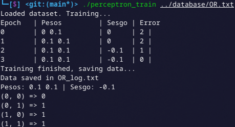

# Perceptron

By Braulio Nayap Maldonado Casilla

## Introducción

El **perceptrón** es uno de los modelos más simples y fundamentales dentro del campo del aprendizaje automático y las redes neuronales artificiales. Fue propuesto por **Frank Rosenblatt** en 1958 como un algoritmo para la clasificación binaria inspirado en el funcionamiento de las neuronas biológicas. [1]

El perceptrón es una neurona artificial que toma un conjunto de entradas:


con pesos asociados:


y un término de sesgo (bias) b, para ser utilizados por una función de activación y producir una salida binaria


El valor neto de entrada se calcula como:


La salida del perceptrón se define como:


## Implementación en C++

### Clase Neuron

La clase `Neuron` es responsable de representar una neurona en una red neuronal, manejando los pesos (weights), el sesgo, y una función de activación (en este caso usaremos escalón por defecto).

```cpp
class Neuron
{
private:
    std::vector<float> weights;
    float sesgo;
    std::function<float(float)> activation;

public:
    Neuron() = default;
    Neuron(int n_inputs, std::function<float(float)> activation_func);
    void set_weights(const std::vector<float> &new_weights);
    float get_weight(int id) const;
    std::vector<float> get_weights() const;
    void set_sesgo(float new_sesgo);
    float get_sesgo() const;

    // Update Values
    void update_weights(const std::vector<float> &inputs, float err, float lr);
    float forward(const std::vector<float> &inputs);
};
```

#### Constructor

Inicializa los pesos en base a la cantidad de entradas y el sesgo de la neurona, y la personalización de la función de activación (por defecto se utiliza la función escalón).

```cpp
Neuron::Neuron(int n_inputs, std::function<float(float)> activation_func)
{
    if (n_inputs <= 0)
        throw std::invalid_argument("Number of inputs must be positive");
    weights.resize(n_inputs, 0);
    sesgo = 0.0f;
    activation = activation_func ? activation_func : [](float x)
    { return x >= 0 ? 1.0f : 0.0f; };
}
```

#### Métodos GET y SET

- `set_weights`: Establece un nuevo conjunto de pesos.
  ```cpp
    void Neuron::set_weights(const std::vector<float> &new_weights)
    {
        if (new_weights.size() != weights.size())
            throw std::invalid_argument("Size of weights /= n inputs");
        weights = new_weights;
    }
  ```
- `get_weight`: Obtiene el peso en una posición específica.

  ```cpp
    float Neuron::get_weight(int id) const
    {
        if (id < 0 || id >= weights.size())
            throw std::out_of_range("Id out of range");
        return weights[id];
    }
  ```

- `get_weights`: Devuelve todos los pesos en un vector.

  ```cpp
    std::vector<float> Neuron::get_weights() const
    {
        return weights;
    }
  ```

- `set_sesgo`: Establece el valor del sesgo.

  ```cpp
    void Neuron::set_sesgo(float new_sesgo)
    {
        sesgo = new_sesgo;
    }
  ```

- `get_sesgo`: Obtiene el valor del sesgo.

  ```cpp
    float Neuron::get_sesgo() const
    {
        return sesgo;
    }
  ```

### Función de actualización de pesos

Recibe los valores de entrada, el error (diferencia entre la salida esperada y la salida real) y la tasa de aprendizaje del entrenamiento realizado en una epoch. Con ello se ajustan los pesos y el sesgo de acuerdo con la regla de actualización de perceptrón (regla delta):

**Regla Delta:** Para cada peso w_i:


Y para el sesgo b:


```cpp
void Neuron::update_weights(const std::vector<float> &inputs, float err, float lr)
{
    if (inputs.size() != weights.size())
        throw std::invalid_argument("Size of inputs /= n inputs");
    for (size_t i = 0; i < weights.size(); i++)
        weights[i] += lr * err * inputs[i];
    sesgo += lr * err;
}
```

### Función Forward (Propagación hacia Adelante)

Calcula la salida de la neurona dados los valores de entrada. La salida se obtiene realizando la suma ponderada de las entradas (producto de cada entrada por su peso respectivo), añadiendo el sesgo y pasando el resultado a través de la función de activación (como en la formula de la Introducción):

```cpp
float Neuron::forward(const std::vector<float> &inputs)
{
    if (inputs.size() != weights.size())
        throw std::invalid_argument("Size of inputs /= n inputs");
    float a = sesgo;
    for (size_t i = 0; i < weights.size(); i++)
        a += weights[i] * inputs[i];
    return activation(a);
}
```

---

### Clase Perceptron

Encapsula el funcionamiento completo de un perceptrón simple binario usando una instancia de la clase `Neuron`. Sus atributos iniciales son la clase Neuron y el ratio de aprendizaje.

```cpp
class Perceptron
{
private:
    Neuron n;
    float lr;

public:
    Perceptron(int n_inputs, float lr = 0.1, std::function<float(float)> act = nullptr);
    void print_weights();
    void train(const std::vector<std::vector<float>> &X, const std::vector<float> &y);
    float predict(const std::vector<float> &inputs);
    void save_weights(const std::string &filename);
    bool load_weights(const std::string &filename);
};
```

#### Constructor

Se recibe como parametros la cantidad de entradas, ratio de aprendizaje y la funcion de aprendizaje. Todo esto se comprueba que no sean datos invalidos y se inicializan `lr` y `neuron`.

```cpp
Perceptron::Perceptron(int n_inputs, float lr_input, std::function<float(float)> act)
{
    if (n_inputs <= 0)
        throw std::invalid_argument("N inputs must be positive: " + std::to_string(n_inputs));
    if (lr <= 0)
        throw std::invalid_argument("Learning rate must be positive: " + std::to_string(lr_input));
    lr = lr_input;
    n = Neuron(n_inputs, act);
}
```

#### Función Entrenamiento

Entrena el perceptrón con un conjunto de características `X` y salidas esperadas `y`. Realiza un bucle hasta que los pesos converjan (no existan errores). Para ello en cada bucle se calcula la prediccion de cada una de las entradas con la función `forward` de la nuerona y se evalúa si hay error con las salidas esperadas, en caso que si existan se procede a ejecutar el ajuste de pesos de la neurona `update_weights`.

```cpp
void Perceptron::train(const std::vector<std::vector<float>> &X, const std::vector<float> &y)
{
    if (X.size() != y.size())
        throw std::invalid_argument("Size of X /= size of y");
    if (X.empty())
        throw std::invalid_argument("X is empty");
    if (X[0].size() != n.get_weights().size())
        throw std::invalid_argument("Size of X[0] /= n inputs");

    int epoch = 0;
    bool converged = false;

    std::cout << "Epoch \t| Pesos \t| Sesgo | Error\n";

    while (!converged)
    {
        converged = true;
        int total_errors = 0;

        for (size_t i = 0; i < X.size(); i++)
        {
            auto prediction = n.forward(X[i]);
            auto err = y[i] - prediction;
            if (err != 0)
            {
                n.update_weights(X[i], err, lr);
                converged = false;
                total_errors++;
            }
        }

        // Imprimir pesos, sesgo y error
        std::cout << epoch << " \t| ";
        for (auto w : n.get_weights())
            std::cout << w << " ";
        std::cout << " \t| " << n.get_sesgo() << " \t| " << total_errors << " |\n";

        epoch++;
    }
}
```

#### Funcion de predicción

Recibe un grupo de entradas, las cuales las pasa por el `forward` de `Neuron` para calcular la salida. Siempre validando que la cantidad de entradas sea congruente.

```cpp
float Perceptron::predict(const std::vector<float> &inputs)
{
    if (inputs.size() != n.get_weights().size())
        throw std::invalid_argument("Size of inputs /= n inputs");
    return n.forward(inputs);
}
```

#### Función de Mostrar Pesos

Muestra los pesos y el sesgo actual que tenga la neurona.

```cpp
void Perceptron::print_weights()
{
    std::cout << "Pesos: ";
    for (auto x : n.get_weights())
        std::cout << x << " ";
    std::cout << "| Sesgo: " << n.get_sesgo() << std::endl;
}
```

#### Función de Guardar y Cargar Pesos

- `save_weights`: Guarda los pesos y sesgo en un archivo txt

```cpp
void Perceptron::save_weights(const std::string &filename)
{
    std::ofstream file(filename);
    for (float x : n.get_weights())
        file << x << " ";
    file << n.get_sesgo() << std::endl;
    file.close();
}
```

- `load_weights`: Carga los pesos que ya fueron guardados para ya no entrenar nuevamente y solo predecir la salida.

```cpp
bool Perceptron::load_weights(const std::string &filename)
{
    std::ifstream file(filename);
    if (!file.is_open())
        return false;
    auto sesgo_backup = n.get_sesgo();
    auto w_backup = n.get_weights();
    for (size_t i = 0; i < w_backup.size(); i++)
        file >> w_backup[i];
    file >> sesgo_backup;
    file.close();
    n.set_weights(w_backup);
    n.set_sesgo(sesgo_backup);
    return true;
}
```

### Clase Dataset

Permite cargar conjuntos de datos desde un archivo de texto y proporciona acceso seguro a las matrices de entradas (`X`) y salidas esperadas (`y`), facilitando la generación autónoma de entrenamiento, sin depender de modificaciones internas del código.

```cpp
class Dataset
{
private:
    std::vector<std::vector<float>> X;
    std::vector<float> y;

public:
    Dataset(const std::string &filename);
    const std::vector<std::vector<float>> &get_X() const;
    const std::vector<float> &get_y() const;
};
```

#### Constructor

Recibe un archivo como entrada y con ese archivo logra recibir en la primera linea `n_inputs` y `n_options`, para conocer cuantas entradas se haran y cuantas opciones de mezcla hay. Luego genera las dos listas de entradas y salidas esperadas que estan en las siguientes líneas.

Ejemplo de archivo `OR.txt`:

```bash
2 4
0 0 0
0 1 1
1 0 1
1 1 1
```

```cpp
Dataset::Dataset(const std::string &filename)
{
    std::ifstream file(filename);
    if (!file.is_open())
        throw std::runtime_error("Cant open file: " + filename);

    int n_inputs, n_options;
    file >> n_inputs >> n_options;
    if (n_inputs < 1 || n_options < 1)
        throw std::runtime_error("Invalid number of inputs or options in file: " + filename);
    X.clear();
    y.clear();

    for (size_t i = 0; i < n_options; i++)
    {
        float output;
        std::vector<float> row(n_inputs);
        for (size_t j = 0; j < n_inputs; j++)
            file >> row[j];
        file >> output;
        X.push_back(row);
        y.push_back(output);
    }
    file.close();
}
```

#### Métodos GET

- `get_X`: Retorna la lista X

```cpp
const std::vector<std::vector<float>> &Dataset::get_X() const
{
    return X;
}
```

- `get_t`: Retorna la lista y

```cpp
const std::vector<float> &Dataset::get_y() const
{
    return y;
}
```

### Ejecutable Train `main_train.cpp`

Se encarga de ejecutar el entrenamiento con un archivo de database.

#### 1. Carga del dataset

Se recibe como parametro el archivo del dataset.txt y este lo carga con la clase `Dataset`, que luego se podra retornar solicitando la lista de entradas y salidas esperadas.

```cpp
std::string dataset_file = argv[1];
Dataset dataset(dataset_file);
std::vector<std::vector<float>> X = dataset.get_X();
std::vector<float> y = dataset.get_y();
```

#### 2. Generación de nombre de archivo para guardar pesos

Se genera un nuevo nombre de archivo obteniendo el archivo original desde el último `/` y el último `.` asi a ese nombre le agregamos la extensión `_log.txt`

```cpp
std::string path = dataset_file;
size_t last_slash = path.find_last_of("/\\");
size_t last_dot = path.find_last_of(".");
std::string base = path.substr(last_slash + 1, last_dot - last_slash - 1);
...
std::string filename = base + "_log.txt";
```

#### 3. Inicialización y entrenamiento del perceptrón

Se inicialiaza el perceptron con los datos recibidos como la cantidad de entradas y se entrena con las listas de entradas y salidas esperadas. Luego se almacenara en el archivo nuevo los resultados.

```cpp
Perceptron p(X[0].size(), 0.1);
p.train(X, y);
p.save_weights(filename);
```

#### 4. Muestra de resultados

Se imprimen las posibles entradas con la salida generada por el perceptron ya entrenado.

```cpp
p.print_weights();
for (auto &input : X)
    std::cout << "(" << input[0] << ", " << input[1] << ") => "
              << static_cast<int>(p.predict(input)) << std::endl;
```

### Ejecutable Train `main_test.cpp`

Se encarga de ejecutar el perceptron pero permite cargar los pesos y realizar una consulta para obtener una salida.

#### 1. Lectura de entradas y archivo

Recibe dos parametros que serán numero flotantes y estos serán los inputs de la consulta y el tercer parametro será el archivo del cuál se cargaran los pesos ya entrenados.

```cpp
float x1 = std::stof(argv[1]);
float x2 = std::stof(argv[2]);
std::string filename = argv[3];
```

#### 2. Inicialización del perceptrón y Carga de pesos

En este caso se inicializa el Perceptron con 2 cantidades de entradas y con un ratio de aprendizaje de 0.1, y luego se procede a cargar los pesos del archivo ingresado, validando siempre que pueda cargarlo.

```cpp
Perceptron p(2, 0.1);
if (!p.load_weights(filename))
{
    std::cerr << "Error: Not load weights for training." << std::endl;
    return 1;
}
```

#### 3. Impresión de Pesos Cargados y Salida de Consulta

Se muestran los pesos cargados del archivo y con las entradas se predice la salida con el perceptrón.

```cpp
p.print_weights();
std::cout << "Input: (" << x1 << ", " << x2 << ") => Output: " << p.predict({x1, x2}) << std::endl;
```

### Ejecución

```bash
make run
```

Con este comando se generará la carpeta `build` y dentro estarán los dos ejecutables `perceptron_test` y `perceptron_train`.

#### Ejecución de Entrenamiento

```bash
cd build
./perceptron_train ../database/[name].txt
```

#### Ejecución de Test o Consulta

```bash
cd build
./perceptron_test 0 1 [name]_log.txt
```

### Salida


#### Ejecución de Entrenamiento




#### Ejecución de Test


## Implementación en Python

Esta implementación nos servira para comparar el resultado generado en C++ y con la librería `sklearn` que ya tiene incorporada el `Perceptron`.

### 1. Función Cargar Data

En esta función leeremos los pesos y el sesgo obtenido de nuestros archivos generados en C++.

```python
def cargar_data(file):
    with open(file, 'r') as f:
        w = list(map(float, f.read().split()))
    return np.array(w[:-1]), w[-1]

w_and, sesgo_and = cargar_data('./build/AND_log.txt')
w_or, sesgo_or = cargar_data('./build/OR_log.txt')
```

### 2. Datos de entrada y salidas esperadas

Declaramos las entradas posibles `X` y las salidas posibles en cada caso como AND (`y_and`) y OR (`y_or`).

```python
X = np.array([[0, 0], [0, 1], [1, 0], [1, 1]])
y_and = np.array([0, 0, 0, 1])
y_or = np.array([0, 1, 1, 1])
```

### 3. Entrenamiento con Scikit-Learn

Entrena el perceptron con una máxima iteración de 100 epocas y con una taza de aprendizaje de 0.1, que debe obtener un sesgo `fit_intercept` y que si se vuelve a llamar se debe reiniciar desde cero el entrenamiento `warm_start`. Se imprimen los valores de cada entrenamiento (pesos y sesgo).

```python
clf_and = Perceptron(max_iter=100, eta0=0.1, fit_intercept=True, warm_start=False)
clf_and.fit(X, y_and)
print("Pesos (AND):", clf_and.coef_, " Bias:", clf_and.intercept_)
clf_or = Perceptron(max_iter=100, eta0=0.1, fit_intercept=True, warm_start=False)
clf_or.fit(X, y_or)
print("Pesos (OR):", clf_or.coef_, " Bias:", clf_or.intercept_)
```

### 4. Graficar las fronteras de decisión

El perceptrón separa clases con una línea de decisión definida por:


Despejando x_2:


Y se hace eso con cada valor de los datos cargados de C++ y con los datos del Scikit-Learn.

```python
axs[0].plot([0, 1], [
    -sesgo_and / w_and[1],
    (-sesgo_and - w_and[0]) / w_and[1]
], label='Neurona C++', color='red')
axs[0].plot([0, 1], [
    -clf_and.intercept_ / clf_and.coef_[0, 1],
    (-clf_and.intercept_ - clf_and.coef_[0, 0]) / clf_and.coef_[0, 1]], label='Python', color='blue')
```

### 5. Mostrar gráfico

Genera dos gráfico mostrando las fronteras de decisión del perceptrón en C++ y del implementado en la librería de Python.

```python
plt.show()
```

### Ejecución

Después de ejecutar el entrenamiento de AND y OR con C++, podremos ejecutar esto.

```bash
python perceptron.py
```

### Salida


## Conclusiones

Los resultados obtenidos muestran una alta coherencia entre ambas implementaciones, tanto en la frontera de decisión como en los parámetros aprendidos. Para la función AND, ambos modelos generaron una frontera de decisión consistente, trazada entre los puntos (2, 0) y (1, 0). En el caso de la función OR, aunque los pesos fueron ligeramente diferentes con un peso en Python de (0.2 0.2 -0.1) y en la C++ (0.1 0.1 -0.1), lo que indica que los modelos aprendieron la misma relación subyacente de manera equivalente, ya que se ve en le gráfico lineas paralelas.

La implementación en C++ ofrece un control detallado sobre el comportamiento del algoritmo, lo que resulta beneficioso para casos de uso que requieran optimización personalizada o integración en sistemas de bajo nivel, como futuras implemnetaciones con más neuronas y más pesos. A pesar de las diferencias en los pesos y sesgos entre ambos modelos, los resultados obtenidos de la comparación gráfica y numérica confirman que ambas implementaciones son efectivas para resolver problemas de clasificación binaria como los probados AND y OR.

## Referencias

[1] Frank Rosenblatt. The perceptron: A probabilistic model for information storage and organization in the brain. Psychological Review, 65(6):386–408, 1958.

## Author

- **ShinjiMC** - [GitHub Profile](https://github.com/ShinjiMC)

## License

This project is licensed under the MIT License. See the [LICENSE](LICENSE) file for details.
